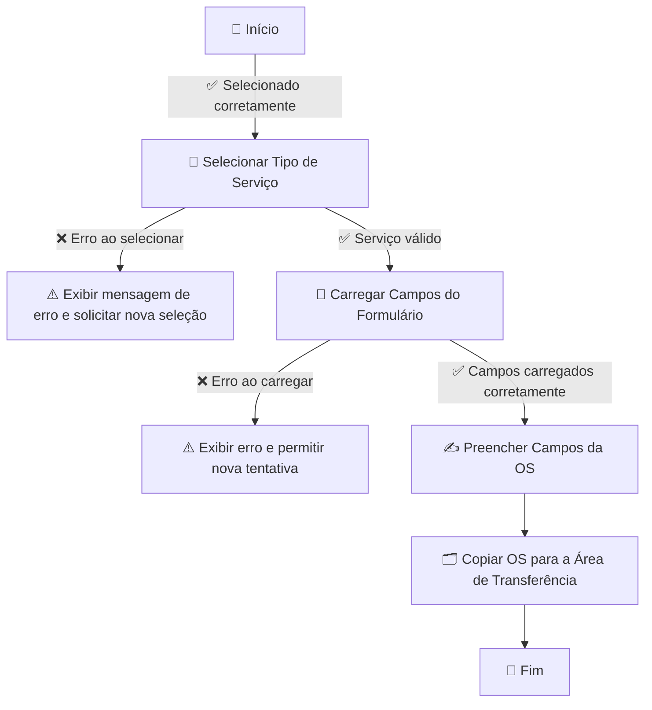
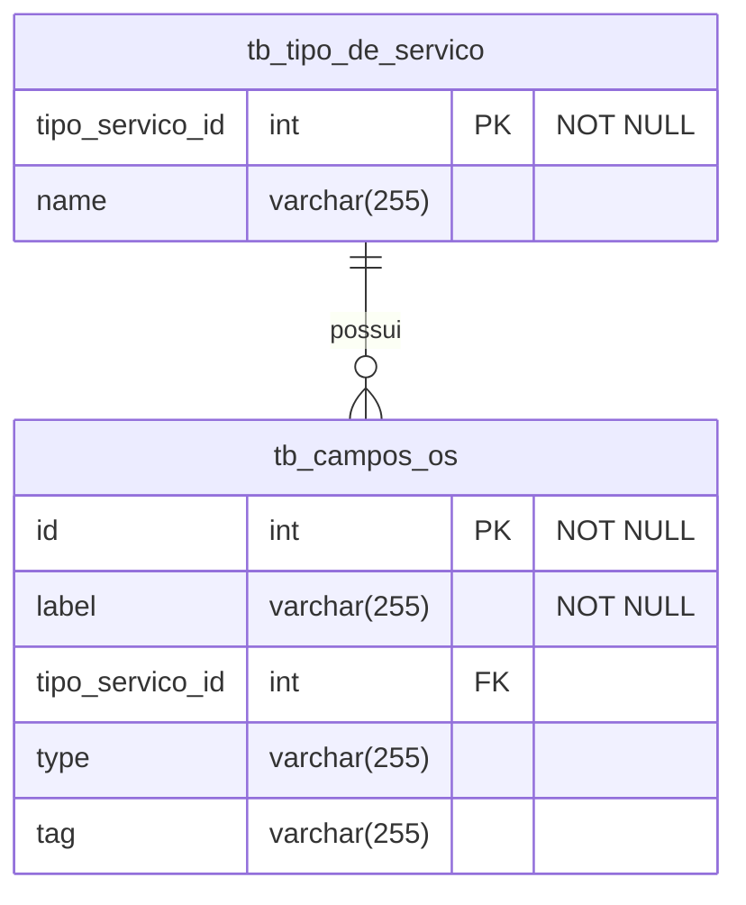

# 📋✨ Gerador de Ordens de Serviço  

Este projeto tem como objetivo **padronizar a criação de ordens de serviço**, garantindo um formato organizado para **evitar erros e agilizar o trabalho no dia a dia**. ⚡📑  

---

## 🚀 Tecnologias Utilizadas  

🖥 **Linguagem:** PHP  
🗄 **Banco de Dados:** MySQL (armazenando tipos de serviço e seus campos)  
🎨 **Frontend:** HTML, CSS, JavaScript  

---

## 🔄 Fluxo do Sistema  

Fluxograma do processo de geração das ordens de serviço:  



---

## 🗃 Modelagem do Banco de Dados  

Diagrama das tabelas principais:  



---

## 🛠 Como Usar  

### 🔧 Configuração do Banco de Dados  

1️⃣ **Crie o banco de dados** no MySQL:  

```sql
CREATE DATABASE gerador_os;
```

---

### 📥 Executando as Migrations  

Para criar as tabelas automaticamente, siga os passos abaixo:  

1️⃣ Acesse a pasta `migrations` e execute os scripts SQL na seguinte ordem:  
   - `create_tb_tipo_servico.sql`  
   - `create_tb_campos_os.sql`  

2️⃣ Insira os tipos de serviços executando o script:  
   - `insert_os_type.sql`,por exemplo:
```sql
INSERT INTO tb_tipo_de_servico (tipo_servico_id,name) VALUES 
(1,'Reparo'),
(2,'Mud.Local de ponto'),
(3,'Mud.Enderelo')
```
3️⃣ Insira os campos das OSs de acordo com o `tipo_servico_id`, por exemplo:  

```sql
INSERT INTO tb_campos_os (label, tipo_servico_id, type, tag) VALUES
('PRAÇA', 1, 'text', 'input'),
('PROBLEMA ALEGADO', 1, 'text', 'textarea'),
('DATA DO AGENDAMENTO', 1, 'date', 'input'),
('PERÍODO', 1, 'text', 'input'),
('VERIFICADO ALARME DO U200', 1, 'text', 'input'),
('SINAL ÓTICO', 1, 'text', 'input'),
('CTO', 1, 'text', 'input'),
('PORTA', 1, 'text', 'input'),
('SSID', 1, 'text', 'input'),
('SENHA', 1, 'text', 'input'),
('PONTOS DE REFERÊNCIA', 1, 'text', 'input'),
('CONTATO DO CLIENTE', 1, 'text', 'input'),
('CONTATO(2) DO CLIENTE', 1, 'text', 'input'),
('OBS', 1, 'text', 'input');
```

---

### ⚙️ Configurando a Conexão com o Banco  

Edite o arquivo `config.php` e configure a conexão:  

```php
<?php
$host = "localhost";
$dbname = "gerador_os";
$username = "root";
$password = "";

try {
    $pdo = new PDO("mysql:host=$host;dbname=$dbname", $username, $password);
    $pdo->setAttribute(PDO::ATTR_ERRMODE, PDO::ERRMODE_EXCEPTION);
} catch (PDOException $e) {
    die("❌ Erro na conexão: " . $e->getMessage());
}
?>
```

---

### 🚀 Executando o Projeto  

1️⃣ **Coloque os arquivos** em um servidor local (XAMPP, WAMP, etc.) dentro da pasta `htdocs`.  
2️⃣ **Acesse o sistema** no navegador: [`http://localhost/gerador_os`](http://localhost/gerador_os)  
3️⃣ **Cadastre os tipos de serviço** na interface ou diretamente no banco.  
4️⃣ **Defina os campos da OS** para cada tipo de serviço.  
5️⃣ **Selecione o tipo de serviço** na interface.  
6️⃣ **Preencha os campos gerados automaticamente.**  
7️⃣ **Clique no botão para copiar os dados da OS para a área de transferência.** 🎯  

