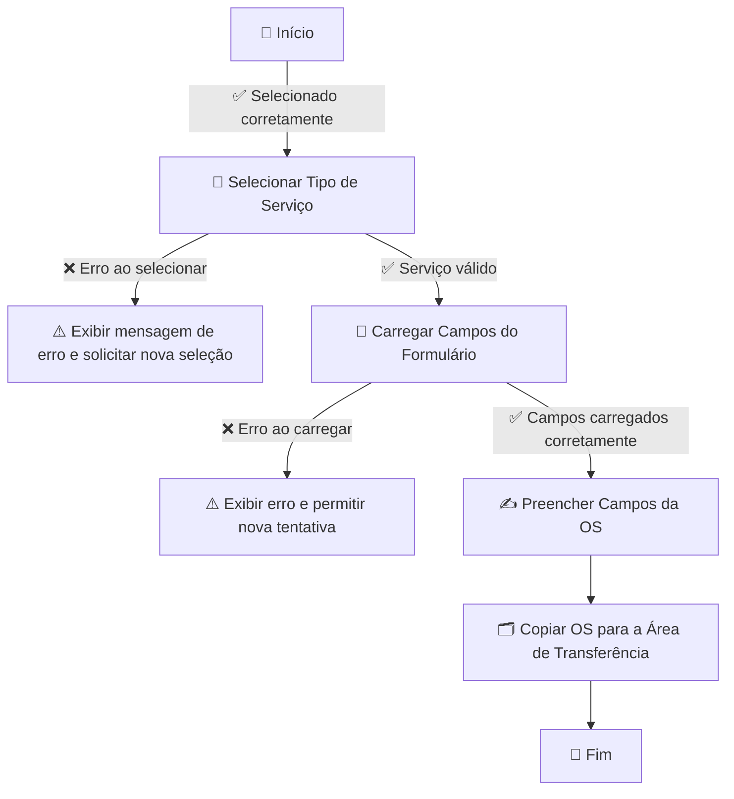
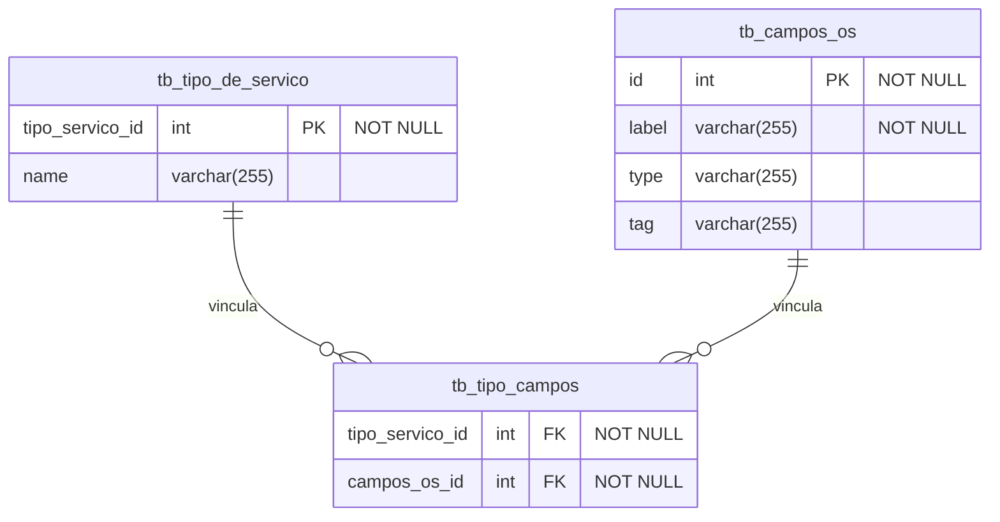
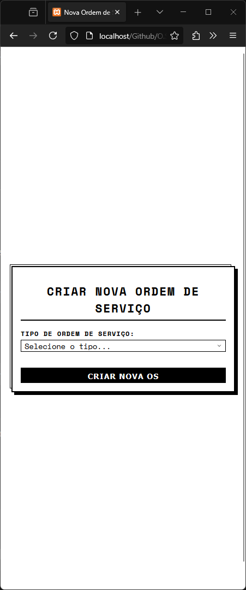
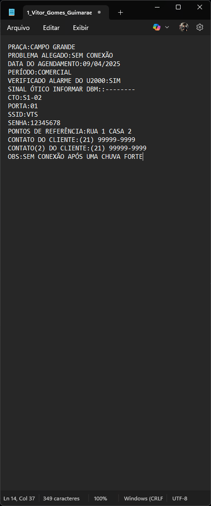

# 📋✨ Gerador de Ordens de Serviço

Este projeto tem como objetivo **padronizar a criação de ordens de serviço**, garantindo um formato organizado para **evitar erros e agilizar o trabalho no dia a dia**. ⚡📑

---

## 🚀 Tecnologias Utilizadas

🖥 **Linguagem:** PHP  
🗄 **Banco de Dados:** MySQL (armazenando tipos de serviço e seus campos)  
🎨 **Frontend:** HTML, CSS, JavaScript  

---

## 🔄 Fluxo do Sistema

Fluxograma do processo de geração das ordens de serviço:  



---

## 🗃 Modelagem do Banco de Dados

Diagrama das tabelas principais:  



---

## 🛠 Como Usar

### 🔧 Configuração do Banco de Dados

1️⃣ **Crie o banco de dados** no MySQL:  

```sql
CREATE DATABASE gerador_os;
```

---

### 📥 Executando as Migrations

Para criar as tabelas automaticamente, siga os passos abaixo:  

1️⃣ Acesse a pasta `migrations` e execute os scripts SQL na seguinte ordem:  
- `create_tb_tipo_servico.sql`  
- `create_tb_campos_os.sql`  
- `create_tb_tipo_campos.sql`

2️⃣ Insira os tipos de serviços executando o script:  
- `insert_os_type.sql`:

```sql
INSERT INTO tb_tipo_de_servico (tipo_servico_id,name) VALUES 
(1,'Reparo'),
(2,'Mud.Local de ponto'),
(3,'Mud.Endereço');
```

3️⃣ Insira os campos de todas as OSs para serem consumidos com `insert_oscampos.sql`:

```sql
INSERT INTO tb_campos_os (label, type, tag) VALUES
('PRAÇA', 'text', 'input'),
('PROBLEMA ALEGADO', 'text', 'input'),
('DATA DO AGENDAMENTO', 'text', 'input'),
('PERÍODO', 'text', 'input'),
('VERIFICADO ALARME DO U2000', 'text', 'input'),
('SINAL ÓTICO: INFORMAR dBm', 'text', 'input'),
('CTO', 'text', 'input'),
('PORTA', 'text', 'input'),
('SSID', 'text', 'input'),
('SENHA', 'text', 'input'),
('ENDEREÇO ANTIGO', 'text', 'input'),
('ALTERADO O ENDEREÇO NO CADASTRO E O.S', 'text', 'input'),
('CLIENTE CIENTE DA POSSÍVEL TAXA', 'text', 'input'),
('( X ) COBRANÇA NA FATURA 1 DIAS', 'text', 'input'),
('VALOR TAXA: R$', 'text', 'input'),
('DESEJA OU NÃO ANTECIPAR', 'text', 'input'),
('PONTOS DE REFERÊNCIA', 'text', 'input'),
('CONTATO DO CLIENTE', 'text', 'input'),
('CONTATO(2) DO CLIENTE', 'text', 'input'),
('OBS:', 'text', 'input');
```

4️⃣ Para vincular os campos ao tipo de serviço, utilize o script `vinculo_campos_reparo.sql`:

```sql
INSERT INTO tb_tipo_campos (campos_os_id, tipo_servico_id) VALUES
(15, 1),
(16, 1),
(17, 1),
(18, 1),
(19, 1),
(20, 1),
(21, 1),
(22, 1),
(23, 1),
(24, 1),
(31, 1),
(32, 1),
(33, 1),
(34, 1);
```

---

### ⚙️ Configurando a Conexão com o Banco

Edite o arquivo `config.php` e configure a conexão:

```php
<?php
$host = "localhost";
$dbname = "gerador_os";
$username = "root";
$password = "";

try {
    $pdo = new PDO("mysql:host=$host;dbname=$dbname", $username, $password);
    $pdo->setAttribute(PDO::ATTR_ERRMODE, PDO::ERRMODE_EXCEPTION);
} catch (PDOException $e) {
    die("❌ Erro na conexão: " . $e->getMessage());
}
?>
```

---

### 🚀 Executando o Projeto

1️⃣ **Coloque os arquivos** em um servidor local (XAMPP, WAMP, etc.) dentro da pasta `htdocs`.  
2️⃣ **Acesse o sistema** no navegador: [`http://localhost/gerador_os`](http://localhost/gerador_os)  
3️⃣ **Cadastre os tipos de serviço** na interface ou diretamente no banco.  
4️⃣ **Defina os campos da OS** para cada tipo de serviço.  
5️⃣ **Selecione o tipo de serviço** na interface.  
6️⃣ **Preencha os campos gerados automaticamente.**  
7️⃣ **Clique no botão para copiar os dados da OS para a área de transferência.** 🎯  

---

<h2>🖼️ Preview do Sistema</h2>

<div style="display: flex; gap: 30px; justify-content: center; align-items: flex-start; margin-bottom: 2rem;">

  <div style="text-align: center; width: 30%;">
    
    <p>🖥️ <strong>Tela Inicial</strong></p>
  </div>

  <div style="text-align: center; width: 30%;">
    
    <p>🛠️ <strong>Seleção de Serviço</strong></p>
  </div>

  <div style="text-align: center; width: 30%;">
    
    <p>📋 <strong>Resultado da Ordem de Serviço</strong></p>
  </div>

</div>


---

